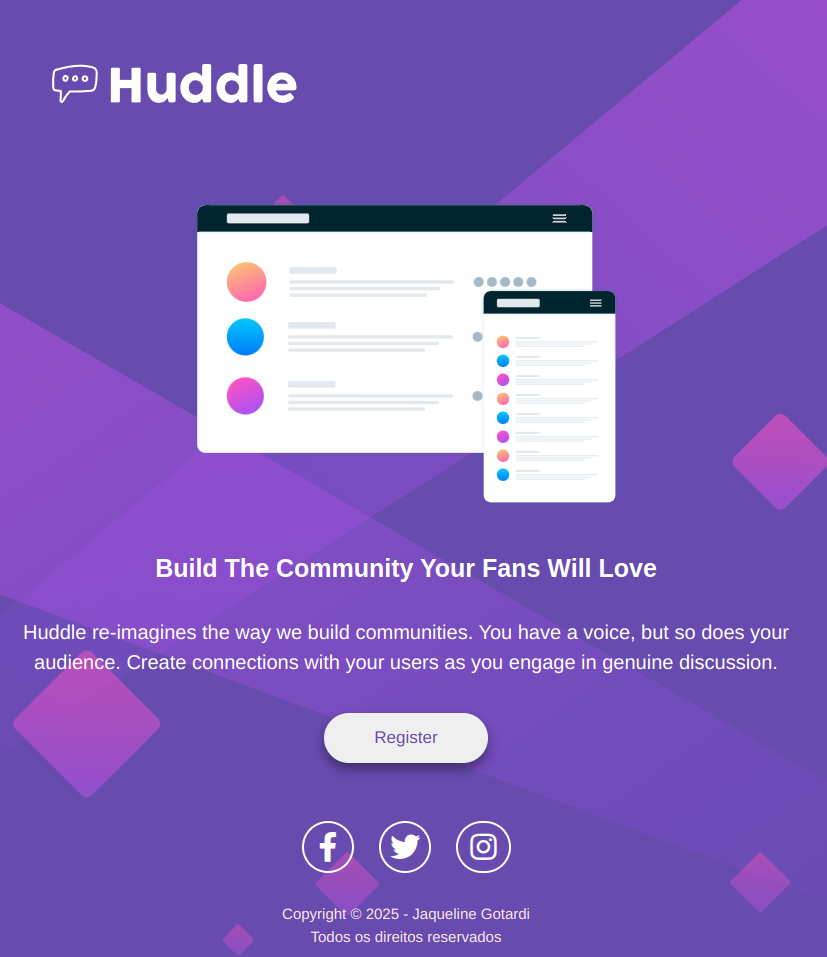

## 💜 Olá, seja bem-vindo(a) a este projeto!

## 📌 Sobre:
Este projeto é parte de um desafio prático criado com o objetivo de exercitar e refinar minhas habilidades em desenvolvimento web. A proposta consiste em recriar uma página de layout base com foco em responsividade, estrutura semântica e boas práticas de HTML e CSS.

## 🎯 Objetivos:

1. Praticar a organização de conteúdo com HTML semântico;

2. Utilizar estilos modernos com CSS;

3. Garantir um design responsivo que funcione bem em diferentes tamanhos de telas;

4. Reproduzir o layout proposto com atenção aos detalhes;

## 🤝 Contribuições:

Sinta-se à vontade para abrir issues, sugerir melhorias ou enviar pull requests! Toda contribuição é bem-vinda e ajuda a tornar o projeto ainda melhor.
Se quiser trocar uma ideia ou dar feedback, entre em contato comigo! Será um prazer! :)

📧 E-mail: jaquelineribeirogotardi@gmail.com  
💼 LinkedIn: Jaqueline Gotardi

## 🔗 Link do projeto:
Você pode visualizar o projeto aqui:   
👉 https://jaqueline-gotardi.github.io/projeto-huddle-base/
